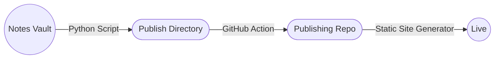

# Introduction
---

## Summary
Design and build a method whereby I can publish multiple "digital gardens" to public hosting from a single Obsidian Vault.

## Minimum Viable Product
- [x] Notes be selectable based on one of the following criteria
	- [x] Path
	- [ ] Tag
- [ ] The subsequent subset of notes must be published to a static web host automatically at the end of the script
## Research
There are multiple different projects in existence for publishing Obsidian Vaults to the web, including Obsidians own offering [Obsidian Publish](https://obsidian.md/publish). None of these met my need of publishing in a granular fashion however so I decided to create my own solution based on "[[Publish Parts Of Obsidian To My Personal Site]]".

## Proposed workflow




## Tasks
```dataview
task from "🗂 Projects/Digital Garden Publishing" and !"🗂 Projects/Digital Garden Publishing/Home"
where !completed
```

